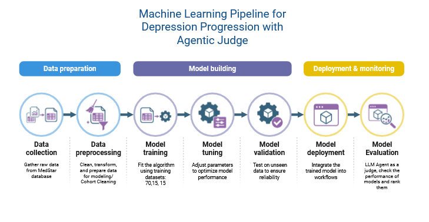

# Depressive_Disorder
# 🧠 Machine Learning Pipeline for Depressive Disorder Progression with Agentic LLM Judge



## 🎯 Project Overview
Depressive_Disorder is a research project designed to predict the 2-year progression from mild to moderate/severe depression using electronic health records (EHR) from the MedStar Health AIM-AHEAD Data Bridge (AADB).

The pipeline includes reproducible machine learning baselines, a deep neural network (DNN), SHAP explainability, and a LLM evaluator (“Judge”) for qualitative model auditing.
All data are de-identified and used in compliance with AIM-AHEAD data-use agreements.

## 🧪 Methodology

Cohort: Patients with depression (ICD-9/10: F32.0, F33.0)

Index Visit: First mild depression diagnosis

Outcome Window: 24 months post-index

Labels:

🩵 Class 0 – remains mild for ≥ 2 years

💔 Class 1 – progresses to moderate/severe within 2 years

Features: demographics, utilization, comorbidities, labs/vitals, medications, social determinants

Models: Logistic Regression, Random Forest, XGBoost, CatBoost, and DNN (PyTorch)

Handling Imbalance: class weights 

Explainability: SHAP

Leakage Control: patient-level splits and time-bounded features

## 🔍 Contributions

📌 pipeline for depression progression prediction

📌 Consistent baseline and deep learning comparison framework

📌 SHAP-based interpretability 

📌 Planned LLM-Judge for qualitative error analysis (FP/FN reasoning)

.
├── CatBoost.ipynb              # Gradient boosting baseline
├── Classes.ipynb               # Cohort building, labeling, splitting
├── DNN.ipynb                   # Deep neural network baseline
├── LR.ipynb                    # Logistic regression model
├── RF.ipynb                    # Random forest model
├── XGB.ipynb                   # XGBoost model
├── SHAPly-Analysis.ipynb       # Global/local SHAP analysis
├── Table_Characteristic.ipynb  # Cohort "Table 1" summary
├── LLM_Evaluator.py            # LLM-as-Judge evaluator
├── workflow.png                # System overview diagram
└── README.md


## CITATION
``` @software{ahadian_2025_depressive_disorder,```
  ```title        = {Depressive_Disorder: Depression Progression Prediction (AIM-AHEAD AADB)},```
```  author       = {Ahadian, Pegah and collaborators},```
```  year         = {2025},```
```  note         = {GitHub repository},```
 ``` howpublished = {\url{https://github.com/<your-username>/<your-repo>}},```
```  version      = {v0.1.0}```
```}```


## 📄 License

Released under the MIT License.


## 🙋 Contact

For questions or collaboration requests, contact the project maintainer Pahadian@kent.edu
